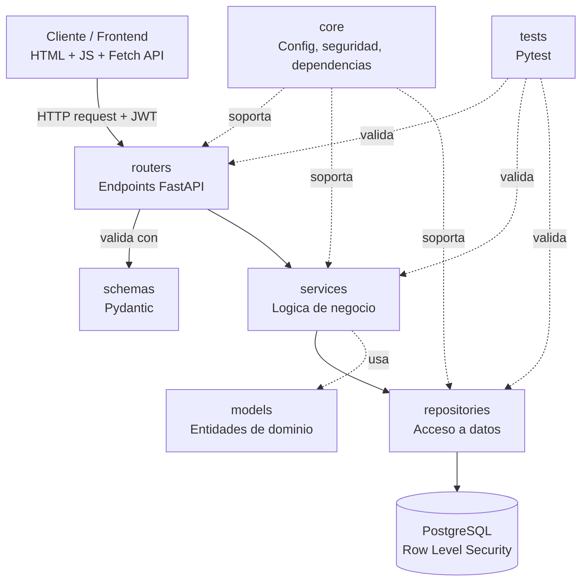
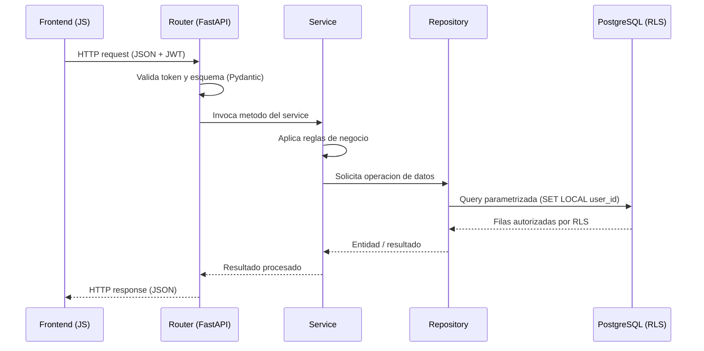
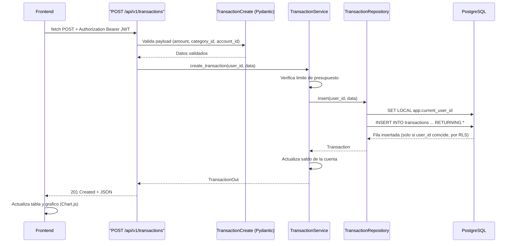

# Arquitectura de Software — FinTrack

## Propósito de este documento

Este documento describe la arquitectura por capas utilizada en FinTrack: la responsabilidad de cada capa, el flujo completo de una petición HTTP, las ventajas del enfoque elegido y un ejemplo práctico de extremo a extremo, desde el frontend hasta PostgreSQL. Está redactado para acompañar el repositorio del proyecto y para que un reclutador técnico (junior o semisenior) pueda evaluar en minutos el criterio de diseño aplicado.

## Visión general

FinTrack implementa una **arquitectura en capas** (layered architecture), un patrón ampliamente utilizado en sistemas backend de producción para separar responsabilidades: qué recibe la petición, qué reglas de negocio aplica y cómo se accede a los datos. El proyecto organiza el backend en siete módulos:

```text
/routers        # Capa de presentación (API)
/services        # Capa de lógica de negocio
/repositories     # Capa de acceso a datos
/models            # Entidades de dominio / ORM
/schemas            # Contratos de entrada y salida (Pydantic)
/core                # Configuración, seguridad y dependencias transversales
/tests                # Pruebas automatizadas (Pytest)
```



Cada flecha representa una dependencia permitida: una capa superior conoce a la inferior, pero nunca al revés. Los `repositories` no conocen a los `services`, ni los `services` conocen a los `routers`. Esta regla de dependencia unidireccional es la que hace que la arquitectura sea mantenible y comprobable.

## Responsabilidad de cada capa

### routers

Responsabilidad: exponer los endpoints HTTP, recibir la petición, delegar en la capa de servicios y devolver la respuesta con el código de estado correcto.

Qué contiene: definiciones de `APIRouter`, rutas agrupadas por dominio (`/transactions`, `/accounts`, `/budgets`, `/auth`), inyección de dependencias (usuario autenticado, sesión de base de datos).

Qué no debe contener: lógica de negocio, cálculos, ni acceso directo a la base de datos.

```python
# app/api/transactions.py
from fastapi import APIRouter, Depends
from app.schemas.transaction import TransactionCreate, TransactionOut
from app.services.transaction_service import TransactionService
from app.core.security import get_current_user

router = APIRouter(prefix="/transactions", tags=["transactions"])

@router.post("/", response_model=TransactionOut, status_code=201)
def create_transaction(
    payload: TransactionCreate,
    current_user = Depends(get_current_user),
    service: TransactionService = Depends(),
):
    return service.create_transaction(user_id=current_user.id, data=payload)
```

### schemas

Responsabilidad: definir el contrato de datos entre el cliente y la API, validando tipos, rangos y formatos antes de que la petición llegue a la lógica de negocio.

Qué contiene: clases Pydantic (`TransactionCreate`, `TransactionOut`, `AccountOut`, etc.), validadores personalizados.

```python
# app/schemas/transaction.py
from pydantic import BaseModel, Field
from decimal import Decimal
from uuid import UUID

class TransactionCreate(BaseModel):
    account_id: UUID
    category_id: UUID
    amount: Decimal = Field(gt=0)
    type: str  # "income" | "expense" | "transfer"
    description: str | None = None
```

### services

Responsabilidad: contener las reglas de negocio. Es la capa donde vive el "cómo funciona" la aplicación, independiente de HTTP y de SQL.

Qué contiene: validaciones de negocio (por ejemplo, que una cuenta pertenezca al usuario), orquestación de varias operaciones (registrar una transacción y actualizar el saldo de la cuenta en la misma operación), reglas de presupuesto.

Qué no debe contener: detalles de FastAPI (objetos `Request`) ni SQL directo.

```python
# app/services/transaction_service.py
class TransactionService:
    def __init__(self, repository: TransactionRepository = Depends()):
        self.repository = repository

    def create_transaction(self, user_id, data: TransactionCreate) -> Transaction:
        # Regla de negocio: validar presupuesto antes de insertar
        self._check_budget_limit(user_id, data)
        transaction = self.repository.insert(user_id, data)
        self.repository.update_account_balance(data.account_id, data.amount, data.type)
        return transaction
```

### repositories

Responsabilidad: ser el único punto de contacto con la base de datos. Traduce operaciones de dominio en consultas SQL o llamadas ORM.

Qué contiene: consultas parametrizadas, manejo de sesión/transacción, configuración del contexto de usuario que activa las políticas de Row Level Security.

```python
# app/repositories/transaction_repository.py
class TransactionRepository:
    def __init__(self, db: Session = Depends(get_db)):
        self.db = db

    def insert(self, user_id, data: TransactionCreate) -> Transaction:
        self.db.execute("SET LOCAL app.current_user_id = :uid", {"uid": str(user_id)})
        result = self.db.execute(
            """
            INSERT INTO transactions (user_id, account_id, category_id, amount, type, description)
            VALUES (:user_id, :account_id, :category_id, :amount, :type, :description)
            RETURNING *
            """,
            {"user_id": user_id, **data.model_dump()},
        )
        return Transaction(**result.fetchone())
```

### models

Responsabilidad: representar las entidades del dominio y su mapeo a las tablas de PostgreSQL.

Qué contiene: definiciones de tablas (SQLAlchemy u otro ORM), relaciones entre entidades (`Transaction`, `Account`, `Category`, `Budget`, `User`).

### core

Responsabilidad: agrupar la configuración y los componentes transversales que usan todas las capas: lectura de variables de entorno, generación y verificación de JWT, hashing de contraseñas, conexión a la base de datos, manejo centralizado de errores.

Qué contiene: `config.py`, `security.py`, `database.py`, dependencias reutilizables (`get_current_user`, `get_db`).

### tests

Responsabilidad: verificar de forma automatizada que cada capa cumple su contrato, de forma aislada y en conjunto.

Qué contiene: pruebas unitarias de `services` (con `repositories` simulados mediante mocks), pruebas de integración de `repositories` contra una base de datos de prueba, y pruebas end-to-end de los `routers` usando el cliente de pruebas de FastAPI (`TestClient`).

## Flujo de una petición HTTP

Toda petición atraviesa las capas en el mismo orden, sin saltos ni atajos:



Puntos clave del flujo:

1. El router nunca decide "si" una operación es válida en términos de negocio; solo valida forma (tipos, campos obligatorios).
2. El service decide "si" la operación puede ejecutarse (reglas de negocio) y "qué" operaciones de datos se necesitan.
3. El repository decide "cómo" se ejecuta esa operación contra PostgreSQL.
4. PostgreSQL aplica una verificación adicional e independiente de la aplicación: RLS. Aunque el service tuviera un error, la base de datos no devuelve ni modifica filas de otro usuario.

## Ventajas de esta arquitectura

- **Separación de responsabilidades (SRP):** cada capa tiene un único motivo para cambiar. Modificar una validación de negocio no toca el router ni el SQL.
- **Testabilidad:** los services pueden probarse inyectando un repository simulado (mock), sin necesidad de una base de datos real; esto permite pruebas unitarias rápidas y confiables.
- **Mantenibilidad:** un desarrollador nuevo puede ubicar el código relevante siguiendo el nombre de la capa, sin leer todo el proyecto.
- **Sustituibilidad:** la base de datos, el ORM o incluso el framework HTTP pueden reemplazarse con impacto acotado, porque la lógica de negocio no depende de sus detalles.
- **Seguridad en profundidad (defense in depth):** la autorización no depende solo de que el código de la aplicación esté libre de errores; RLS actúa como una segunda barrera a nivel de base de datos.
- **Colaboración en equipo:** los límites entre capas facilitan la revisión de código y permiten que distintas personas trabajen en paralelo sobre contratos (schemas) ya definidos.

## Ejemplo práctico completo: registrar un gasto

Caso de uso: el usuario registra un gasto desde el dashboard. Se sigue la petición `POST /api/v1/transactions` a través de todas las capas.



1. **Frontend:** el módulo ES6 de transacciones envía la petición con Fetch API, incluyendo el JWT en la cabecera `Authorization`.

   ```javascript
   const response = await fetch(`${API_BASE_URL}/transactions`, {
     method: "POST",
     headers: {
       "Content-Type": "application/json",
       Authorization: `Bearer ${accessToken}`,
     },
     body: JSON.stringify({
       account_id: accountId,
       category_id: categoryId,
       amount: 45000,
       type: "expense",
       description: "Mercado del mes",
     }),
   });
   ```

2. **Router:** recibe la petición, resuelve el usuario autenticado a partir del JWT y delega en el service.
3. **Schema:** valida que `amount` sea mayor que cero y que los campos requeridos estén presentes; si algo falla, FastAPI responde `422` antes de llegar al service.
4. **Service:** aplica la regla de negocio (por ejemplo, verificar que el gasto no exceda el presupuesto mensual de la categoría) y coordina dos operaciones relacionadas: insertar la transacción y actualizar el saldo de la cuenta.
5. **Repository:** ejecuta la inserción con una consulta parametrizada y establece el contexto de usuario (`SET LOCAL app.current_user_id`) que las políticas de RLS usan para autorizar la operación.
6. **PostgreSQL:** aplica la política de RLS de la tabla `transactions` (por ejemplo, `USING (user_id = current_setting('app.current_user_id')::uuid)`), garantizando que la fila solo se inserte o consulte si pertenece al usuario autenticado.
7. **Respuesta:** el resultado sube de nuevo por las capas hasta convertirse en un `TransactionOut`, que el router serializa como JSON.
8. **Frontend:** recibe la respuesta `201 Created`, agrega la fila a la tabla de movimientos y actualiza el gráfico de Chart.js correspondiente.

## Justificación técnica para reclutadores junior y semisenior

Esta arquitectura no es una elección arbitraria: refleja decisiones de diseño que un equipo de ingeniería evalúa en una entrevista técnica.

- **Principios SOLID aplicados:** cada capa respeta el principio de responsabilidad única, y los services dependen de abstracciones (repositories inyectados), no de implementaciones concretas, lo que facilita sustituir la fuente de datos sin reescribir la lógica de negocio.
- **Seguridad como requisito de diseño, no como añadido:** combinar JWT a nivel de aplicación con Row Level Security a nivel de base de datos demuestra comprensión de "defense in depth", un criterio que distingue a un perfil junior de uno con visión de producción.
- **Disciplina de pruebas:** al desacoplar servicios de repositorios, el proyecto puede tener cobertura de pruebas unitarias real (no solo pruebas end-to-end), lo cual es un indicador que los equipos de ingeniería valoran al revisar un portafolio.
- **Contratos explícitos:** el uso de Pydantic para schemas de entrada y salida documenta automáticamente la API (Swagger/OpenAPI) y reduce errores de integración entre frontend y backend.
- **Preparación para escalar el equipo:** una arquitectura por capas con límites claros es la misma que se encuentra, en distintas variantes, en sistemas de producción de mayor escala (arquitectura hexagonal, Clean Architecture); dominarla en un proyecto propio acelera la adaptación a una base de código profesional existente.

## Referencias

- FastAPI — [Bigger Applications: Multiple Files](https://fastapi.tiangolo.com/tutorial/bigger-applications/), guía oficial sobre organización de una aplicación FastAPI en módulos.
- PostgreSQL — [Row Security Policies](https://www.postgresql.org/docs/current/ddl-rowsecurity.html), documentación oficial sobre Row Level Security.
- Robert C. Martin, *Clean Architecture: A Craftsman's Guide to Software Structure and Design* — referencia conceptual sobre la separación en capas y la regla de dependencia unidireccional.
