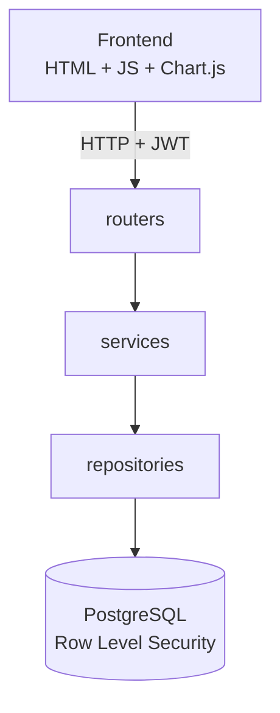

# Caso de Estudio — FinTrack

> Cómo diseñé y construí una plataforma de finanzas personales full-stack, con seguridad en dos capas y arquitectura de producción, como pieza central de mi portafolio como desarrolladora.

---

## Tabla de contenido

1. [Resumen ejecutivo](#1-resumen-ejecutivo)
2. [Problema identificado](#2-problema-identificado)
3. [Análisis de necesidades del usuario](#3-análisis-de-necesidades-del-usuario)
4. [Objetivos del proyecto](#4-objetivos-del-proyecto)
5. [Investigación previa](#5-investigación-previa)
6. [Diseño de la solución](#6-diseño-de-la-solución)
7. [Arquitectura elegida](#7-arquitectura-elegida)
8. [Justificación tecnológica](#8-justificación-tecnológica)
9. [Principales desafíos encontrados](#9-principales-desafíos-encontrados)
10. [Cómo fueron resueltos](#10-cómo-fueron-resueltos)
11. [Estrategias de seguridad implementadas](#11-estrategias-de-seguridad-implementadas)
12. [Resultados obtenidos](#12-resultados-obtenidos)
13. [Lecciones aprendidas](#13-lecciones-aprendidas)
14. [Mejoras futuras](#14-mejoras-futuras)
15. [Reflexión profesional de la desarrolladora](#15-reflexión-profesional-de-la-desarrolladora)
16. [Impacto del proyecto en mi crecimiento técnico](#16-impacto-del-proyecto-en-mi-crecimiento-técnico)

---

## 1. Resumen ejecutivo

FinTrack es una plataforma full-stack de finanzas personales que diseñé y construí para resolver un problema concreto —la falta de control y visibilidad sobre las finanzas del día a día— y, al mismo tiempo, para demostrar con una base de código real mi capacidad de construir software de producción: arquitectura por capas, seguridad de datos en dos niveles independientes, y un flujo de despliegue funcional de extremo a extremo. El proyecto combina un backend en Python con FastAPI, una base de datos PostgreSQL protegida con Row Level Security, y un frontend en HTML, CSS y JavaScript puro con Chart.js, todo cubierto con pruebas automatizadas y desplegado en un entorno real (Render y Neon).

## 2. Problema identificado

Las aplicaciones de finanzas personales disponibles suelen exigir conectar credenciales bancarias reales para automatizar el registro de movimientos, lo cual genera una barrera de confianza y privacidad para muchos usuarios. En el extremo opuesto, herramientas como las hojas de cálculo ofrecen control total pero carecen de estructura, validaciones y visualización, y se vuelven difíciles de mantener con el tiempo.

Identifiqué una necesidad intermedia, especialmente relevante para estudiantes, profesionales independientes y freelancers con ingresos variables: una herramienta estructurada y visual, que no dependa de conectar cuentas bancarias reales, y que dé visibilidad clara sobre en qué se gasta el dinero, cómo evoluciona el presupuesto y qué tan cerca se está de las metas de ahorro.

## 3. Análisis de necesidades del usuario

A partir del perfil de usuario objetivo (estudiantes, profesionales y freelancers), definí las necesidades funcionales y no funcionales que debía cubrir la plataforma:

- **Registro simple y estructurado** de ingresos, gastos y transferencias, sin fricción.
- **Organización por cuentas y categorías**, ya que este tipo de usuario suele manejar más de una cuenta (efectivo, cuenta bancaria, ahorros).
- **Visibilidad del comportamiento financiero** mediante presupuestos y dashboards, no solo un listado de movimientos.
- **Confianza en el manejo de datos sensibles**, dado que se trata de información financiera personal, sin necesidad de vincular credenciales bancarias reales.
- **Accesibilidad**, incluyendo soporte de modo oscuro, para un uso cómodo y prolongado.

## 4. Objetivos del proyecto

**Objetivos de producto:** permitir el registro y clasificación de ingresos, gastos y transferencias; ofrecer visibilidad financiera mediante presupuestos, metas de ahorro y dashboards; garantizar que cada usuario acceda únicamente a su propia información.

**Objetivos técnicos:** aplicar una arquitectura por capas que separe presentación, lógica de negocio y acceso a datos; implementar autenticación propia con JWT; reforzar la seguridad con Row Level Security a nivel de base de datos; cubrir la lógica de negocio con pruebas automatizadas; desplegar el proyecto en un entorno real y accesible públicamente.

**Objetivo de carrera:** convertir a FinTrack en la pieza central de mi portafolio, demostrando dominio real de cada componente del stack, sin depender de servicios gestionados que oculten cómo funcionan realmente, como respaldo de mi búsqueda de un primer empleo remoto como desarrolladora junior.

## 5. Investigación previa

Antes de definir la arquitectura, revisé prácticas reconocidas de la industria relevantes para este tipo de sistema:

- Patrones comunes en aplicaciones de finanzas personales: separación de cuentas, categorización de movimientos, presupuestos por categoría y metas de ahorro como estructura de datos base.
- Buenas prácticas de seguridad para APIs que manejan datos sensibles, en particular las categorías de riesgo descritas en el [OWASP API Security Top 10](https://owasp.org/www-project-api-security/), como la autorización rota a nivel de objeto.
- Row Level Security como mecanismo nativo de PostgreSQL para aislar datos por usuario a nivel de base de datos, documentado en la [guía oficial de PostgreSQL](https://www.postgresql.org/docs/current/ddl-rowsecurity.html).
- La guía oficial de FastAPI sobre organización de aplicaciones en múltiples módulos ([Bigger Applications](https://fastapi.tiangolo.com/tutorial/bigger-applications/)), como referencia para estructurar el backend en capas.

## 6. Diseño de la solución

Diseñé FinTrack como un sistema donde la interfaz (dashboard, formularios de transacciones, gráficas) consume una API REST propia, y donde cada operación relevante para las finanzas del usuario —registrar un gasto, actualizar un presupuesto, cerrar una meta de ahorro— pasa por una validación explícita antes de tocar la base de datos. El diseño prioriza dos cosas por encima de la velocidad de desarrollo: que los datos de cada usuario estén completamente aislados de los demás, y que el sistema sea fácil de extender con nuevas funcionalidades sin reescribir lo ya construido.

## 7. Arquitectura elegida

Elegí una arquitectura por capas (routers, services, repositories), apoyada en schemas de validación (Pydantic), modelos de dominio y una capa transversal de configuración y seguridad (core).

Cada capa depende únicamente de la inferior, nunca al revés, lo que me permitió probar la lógica de negocio (`services`) sin depender de una base de datos real, y sustituir detalles de implementación sin afectar al resto del sistema. El detalle completo de esta arquitectura, con ejemplos de código por capa, está documentado en `ARCHITECTURE.md`.

## 8. Justificación tecnológica

| Decisión | Por qué la tomé |
|---|---|
| FastAPI | Framework asíncrono con validación de datos integrada (Pydantic) y documentación OpenAPI automática, lo que acelera el desarrollo sin sacrificar rigor. |
| PostgreSQL + Row Level Security | Una base de datos relacional robusta, con un mecanismo nativo para garantizar el aislamiento de datos entre usuarios como control independiente del código de la aplicación. |
| JWT + Passlib/Bcrypt | Autenticación sin estado, adecuada para separar frontend y backend, con hashing de contraseñas diseñado específicamente para resistir ataques de fuerza bruta. |
| JavaScript puro (sin framework) | Decidí no usar un framework de frontend para demostrar dominio real del DOM, módulos ES6 y Fetch API, en lugar de depender de abstracciones que ocultan esos fundamentos. |
| Pytest | Estándar de la comunidad Python para pruebas automatizadas, con buena integración con FastAPI. |
| Render + Neon | Me permitieron desplegar un entorno de producción real (backend, frontend estático y base de datos) sin costo, evitando que el proyecto se quedara solo en el entorno local. |

## 9. Principales desafíos encontrados

*Nota para completar antes de publicar: esta sección debe reflejar tu experiencia real de desarrollo. Dejo identificados los puntos de mayor complejidad técnica inherentes al diseño del proyecto, como guía; complétalos o reemplázalos con los retos concretos que tú viviste.*

- [Ejemplo: coordinar la actualización de dos cuentas en una transferencia sin dejar el sistema en un estado inconsistente si algo falla a mitad de camino]
- [Ejemplo: entender y configurar correctamente el contexto de usuario para que las políticas de Row Level Security se aplicaran en cada conexión a la base de datos]
- [Ejemplo: decidir la estrategia de expiración de los JWT sin comprometer la experiencia de usuario ni la seguridad]
- [Ejemplo: manejar el estado de la interfaz y las actualizaciones del dashboard en JavaScript puro, sin el soporte de un framework]
- [Ejemplo: ajustar la configuración de CORS y variables de entorno al pasar de un entorno local a Render y Neon en producción]

## 10. Cómo fueron resueltos

*Nota para completar: para cada desafío de la sección anterior, describe el proceso real que seguiste —qué probaste primero, qué no funcionó y cómo llegaste a la solución final—. A modo de referencia técnica, así es como se resuelven correctamente los puntos anteriores:*

- Una transferencia entre cuentas se puede resolver envolviendo ambas actualizaciones en una única transacción de base de datos, de forma que si una parte falla, ninguna se aplica (atomicidad).
- El contexto de usuario para Row Level Security se establece en el repository, al inicio de cada operación, mediante una instrucción de sesión que las políticas de la base de datos usan para filtrar las filas.
- La expiración de los JWT se resuelve definiendo un tiempo de vida razonable para el `access_token`, dejando como mejora futura un `refresh_token` para renovar la sesión sin pedir credenciales de nuevo (ver Roadmap, sección 14, y `SECURITY.md`).

[Agrega aquí tu propio relato: qué intentaste primero, qué obstáculo específico encontraste y cómo llegaste a la solución que finalmente quedó en el proyecto.]

## 11. Estrategias de seguridad implementadas

FinTrack aplica un modelo de seguridad en dos capas independientes: a nivel de aplicación (autenticación JWT, contraseñas con hashing bcrypt, validación estricta de entrada con Pydantic, consultas parametrizadas para prevenir inyección SQL) y a nivel de base de datos (Row Level Security, que impide que un usuario acceda a los datos de otro incluso ante un error en la lógica de negocio). Esta redundancia intencional —conocida como defensa en profundidad— es la estrategia central de seguridad del proyecto y está documentada en detalle en `SECURITY.md`, incluyendo los riesgos identificados, los ya mitigados y las recomendaciones pendientes.

## 12. Resultados obtenidos

*Nota para completar: agrega aquí las métricas reales de tu proyecto (cobertura de pruebas, número de endpoints, tiempos de respuesta, etc.). Estos son los resultados cualitativos ya respaldados por el trabajo documentado:*

- Una aplicación full-stack funcional, con backend, frontend y base de datos desplegados en un entorno de producción real (Render y Neon).
- Una arquitectura por capas mantenible y probada, que separa claramente presentación, lógica de negocio y acceso a datos.
- Un modelo de seguridad de dos capas (JWT + Row Level Security) documentado y evaluado frente a los riesgos más comunes de una API financiera.
- Una suite de documentación técnica profesional del proyecto (`README.md`, `ARCHITECTURE.md`, `SECURITY.md`, `DOCUMENTATION.md`, `LEGAL.md`), que respalda la comunicación técnica del trabajo realizado.
- [Agrega aquí: cobertura de pruebas alcanzada, número de funcionalidades completadas frente a las planeadas, tiempo de desarrollo, u otra métrica que puedas respaldar.]

## 13. Lecciones aprendidas

*Nota para completar: solo tú conoces los aprendizajes concretos de tu propio proceso. Estos son puntos de partida derivados de las decisiones de diseño del proyecto:*

- Diseñar la autorización en dos capas (JWT y Row Level Security) desde el inicio, en lugar de añadir seguridad al final, cambia la forma de pensar cada funcionalidad nueva.
- Separar routers, services y repositories facilita agregar funcionalidades y escribir pruebas unitarias, en comparación con concentrar la lógica en los endpoints.
- Construir el frontend sin un framework profundiza la comprensión de los fundamentos del navegador (DOM, estado, Fetch API).

[Agrega aquí tus propios aprendizajes: qué harías diferente si empezaras hoy, qué concepto te costó más entender y cómo lo resolviste.]

## 14. Mejoras futuras

- Documentación exhaustiva de la API REST, endpoint por endpoint.
- Integración continua (CI) con Pytest ejecutándose en cada push.
- Límite de intentos de inicio de sesión y autenticación multifactor.
- Estrategia de refresh token y revocación de sesiones.
- Capa de caché para las consultas de dashboard.
- Notificaciones de presupuesto, exportación en PDF, soporte multi-moneda y categorización automática de gastos.

## 15. Reflexión profesional de la desarrolladora

*Nota para completar: esta sección debe estar escrita completamente en tu voz. Aquí tienes una estructura guía con preguntas que puedes responder para construirla:*

[¿Qué te llevó a elegir el desarrollo full-stack como camino profesional? ¿Qué papel jugó FinTrack en consolidar esa decisión? ¿Qué tipo de desarrolladora quieres ser, y en qué parte de este proyecto se refleja eso?]

## 16. Impacto del proyecto en mi crecimiento técnico

*Nota para completar: describe en primera persona qué habilidades concretas ganaste construyendo este proyecto. Algunas preguntas guía:*

[¿Fue la primera vez que implementaste autenticación propia con JWT? ¿La primera vez que diseñaste una arquitectura por capas desde cero? ¿La primera vez que desplegaste una aplicación real a producción? ¿Cómo cambió tu forma de abordar un problema de software antes y después de este proyecto?]

