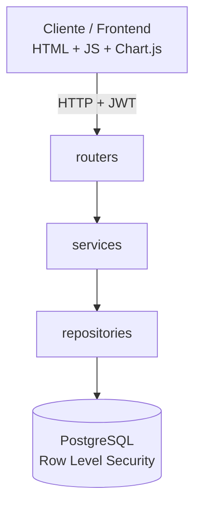
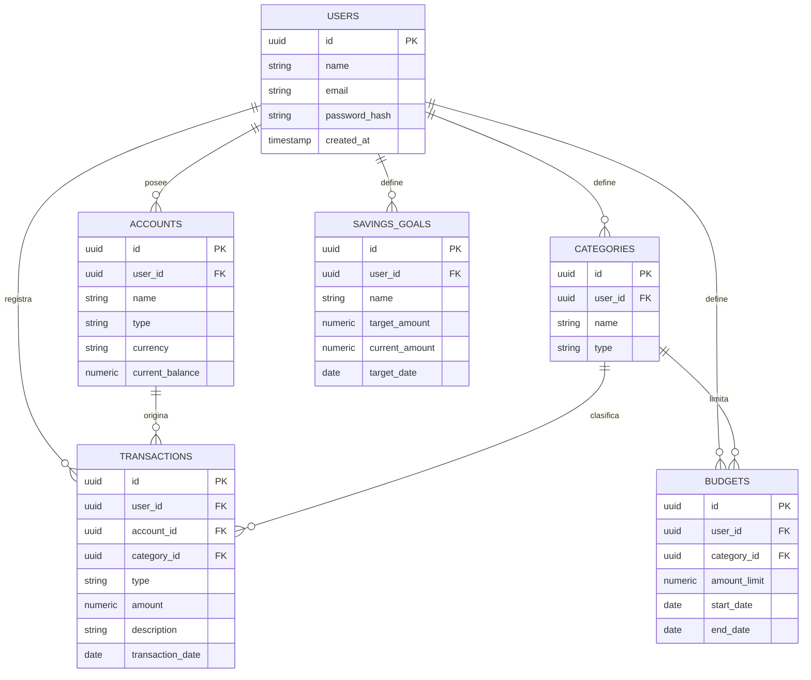

# Documentación Técnica y de Producto — FinTrack

> Documento de referencia para presentar el proyecto en el repositorio de GitHub y en entrevistas técnicas.

Este documento complementa al `../README.md` (guía de uso e instalación) y a `architecture.md` (detalle de implementación por capas, con código y diagramas de flujo). Aquí se documenta el proyecto de forma integral: el problema que resuelve, las decisiones de diseño, el modelo de datos, la seguridad, la estrategia de pruebas, el despliegue y la proyección a futuro. La referencia de endpoints está en `api-reference.md` y la especificación viva en `/openapi.json`.

---

## Tabla de contenido

1. [Resumen ejecutivo](#1-resumen-ejecutivo)
2. [Problema de negocio](#2-problema-de-negocio)
3. [Objetivos del proyecto](#3-objetivos-del-proyecto)
4. [Arquitectura](#4-arquitectura)
5. [Tecnologías seleccionadas](#5-tecnologías-seleccionadas)
6. [Estructura de carpetas](#6-estructura-de-carpetas)
7. [Modelo de datos](#7-modelo-de-datos)
8. [Seguridad](#8-seguridad)
9. [API REST](#9-api-rest)
10. [Testing](#10-testing)
11. [Despliegue](#11-despliegue)
12. [Escalabilidad](#12-escalabilidad)
13. [Rendimiento](#13-rendimiento)
14. [Roadmap](#14-roadmap)
15. [Lecciones aprendidas](#15-lecciones-aprendidas)
16. [Conclusiones](#16-conclusiones)

---

## 1. Resumen ejecutivo

FinTrack es una aplicación full-stack de finanzas personales que permite registrar ingresos, gastos y transferencias, administrar múltiples cuentas y categorías, definir presupuestos mensuales y metas de ahorro, y visualizar hábitos de consumo mediante dashboards interactivos. Está dirigida a estudiantes, profesionales y freelancers que necesitan una herramienta simple y transparente para controlar sus finanzas, sin depender de aplicaciones que exigen conectar credenciales bancarias reales.

El backend está construido en Python con FastAPI, siguiendo una arquitectura por capas (routers, services, repositories) y autenticación propia mediante JWT. La seguridad de los datos se refuerza a nivel de base de datos con PostgreSQL y Row Level Security, de forma que el aislamiento entre usuarios no depende únicamente del código de la aplicación. El frontend se implementa en HTML, CSS y JavaScript puro con Chart.js para las visualizaciones, sin frameworks intermedios. El proyecto incluye pruebas automatizadas con Pytest y un flujo de despliegue gratuito en Render con Neon como base de datos en producción.

Más allá de su función como herramienta de finanzas personales, FinTrack es el proyecto central del portafolio técnico de su desarrolladora, diseñado para demostrar, con una base de código real y funcional, competencias en arquitectura de software, seguridad de datos, diseño de APIs y prácticas de desarrollo full-stack.

## 2. Problema de negocio

Gran parte de las herramientas de finanzas personales disponibles hoy exigen conectar credenciales bancarias reales (open banking) para automatizar el registro de movimientos, lo que introduce una barrera de confianza y de privacidad para muchos usuarios. En el otro extremo, las hojas de cálculo ofrecen control total pero carecen de estructura, validaciones y visualización, y se vuelven difíciles de mantener con el tiempo.

Estudiantes, profesionales independientes y freelancers —que suelen tener ingresos variables y múltiples cuentas— necesitan un punto intermedio: una herramienta estructurada, visual y segura, que no dependa de la conexión directa a sus bancos y que les dé visibilidad clara de en qué gastan su dinero, cómo evoluciona su presupuesto y qué tan cerca están de sus metas de ahorro.

FinTrack responde a esa necesidad: un registro manual pero estructurado y validado, con dashboards que convierten los datos en información accionable, y con una arquitectura de seguridad que protege la información financiera del usuario como un activo sensible desde el diseño, no como una capa añadida después.

## 3. Objetivos del proyecto

**Objetivos de producto**

- Permitir el registro y clasificación de ingresos, gastos y transferencias entre cuentas.
- Ofrecer visibilidad del comportamiento financiero mediante presupuestos, metas de ahorro y dashboards.
- Garantizar que cada usuario acceda únicamente a su propia información, incluso ante errores de la capa de aplicación.
- Ofrecer una experiencia accesible, con soporte de modo oscuro.

**Objetivos técnicos**

- Aplicar una arquitectura por capas que separe presentación, lógica de negocio y acceso a datos.
- Implementar autenticación propia (JWT) sin depender de proveedores externos de identidad.
- Reforzar la seguridad de los datos con Row Level Security a nivel de base de datos.
- Cubrir la lógica de negocio con pruebas automatizadas (Pytest).
- Desplegar el proyecto en un entorno real y accesible públicamente, con costo operativo nulo.

**Objetivo de carrera**

- Convertir a FinTrack en la pieza central de un portafolio profesional que respalde la búsqueda de un primer empleo remoto como desarrolladora junior, demostrando dominio real —no asistido por servicios gestionados que oculten el funcionamiento interno— de cada componente del stack.

## 4. Arquitectura

FinTrack implementa una arquitectura en capas: `routers` (presentación/API), `services` (lógica de negocio), `repositories` (acceso a datos), apoyadas por `schemas` (contratos de entrada/salida), `models` (entidades de dominio), `core` (configuración y seguridad transversal) y `tests` (verificación automatizada).



La regla de dependencia es unidireccional: cada capa conoce a la inferior, nunca a la superior. El detalle completo de esta arquitectura —responsabilidad de cada capa, flujo de una petición HTTP paso a paso y un ejemplo end-to-end con código— está documentado en `architecture.md`.

## 5. Tecnologías seleccionadas

| Capa | Tecnología | Justificación |
|---|---|---|
| Backend | FastAPI (Python) | Framework asíncrono de alto rendimiento, validación de datos integrada vía Pydantic y generación automática de documentación OpenAPI/Swagger. |
| Autenticación | JWT + Passlib/Bcrypt | Autenticación sin estado (stateless), adecuada para separar frontend y backend; bcrypt es un algoritmo de hashing diseñado específicamente para contraseñas. |
| Base de datos | PostgreSQL | Base de datos relacional robusta, con soporte nativo de Row Level Security, ideal para datos financieros que exigen integridad y control de acceso granular. |
| Base de datos en producción | Neon | Postgres serverless con capa gratuita, sin necesidad de administrar infraestructura de base de datos. |
| Frontend | HTML, CSS, JavaScript ES6 | Sin frameworks intermedios: permite demostrar dominio de los fundamentos (DOM, módulos nativos, Fetch API) y mantiene el proyecto liviano y sin build step. |
| Visualización | Chart.js | Librería madura y liviana para gráficas interactivas, sin curva de aprendizaje pronunciada. |
| Testing | Pytest | Estándar de facto para pruebas en Python, con soporte de fixtures y buena integración con FastAPI. |
| Despliegue | Render | Despliegue gratuito de backend (Web Service) y frontend (Static Site), con integración directa desde el repositorio Git. |

## 6. Estructura de carpetas

```
fintrack/
├── backend/
│   ├── app/
│   │   ├── api/                # Routers
│   │   ├── core/                # Configuración, seguridad, dependencias
│   │   ├── schemas/             # Esquemas Pydantic
│   │   ├── services/            # Lógica de negocio
│   │   ├── repositories/        # Acceso a datos
│   │   ├── models/               # Modelos de base de datos
│   │   └── main.py
│   ├── tests/
│   ├── requirements.txt
│   └── .env.example
├── frontend/
│   ├── css/
│   ├── js/
│   │   ├── modules/
│   │   └── main.js
│   └── index.html
├── docs/
│   ├── architecture.md
│   ├── case-study.md
│   ├── documentation.md
│   ├── legal.md
│   ├── security.md
│   └── user-guide.md
├── .gitignore
└── README.md
```

Nota: ajusta esta estructura a la organización real de tu repositorio.

## 7. Modelo de datos

El modelo de datos implementado en PostgreSQL incluye cuentas, categorías, transacciones, presupuestos y metas de ahorro. Las tablas con datos de usuario están protegidas por RLS.



Todas las tablas que almacenan información propia de un usuario incluyen la columna `user_id`, sobre la cual se define la política de Row Level Security correspondiente (ver sección 8).

## 8. Seguridad

FinTrack aplica seguridad en dos niveles independientes:

- **Nivel de aplicación:** autenticación mediante JWT, contraseñas con hashing bcrypt (nunca en texto plano), validación estricta de entrada con Pydantic, y comunicación cifrada mediante HTTPS/TLS.
- **Nivel de base de datos:** políticas de Row Level Security en PostgreSQL que restringen cada consulta e inserción a las filas cuyo `user_id` coincide con el usuario autenticado, de forma que un error en la lógica de negocio no puede exponer datos de otro usuario.

Esta combinación sigue el principio de "defensa en profundidad": ninguna de las dos capas depende exclusivamente de que la otra esté libre de errores. Las prácticas aplicadas están alineadas con las categorías de riesgo descritas en el [OWASP API Security Top 10](https://owasp.org/www-project-api-security/), en particular autorización a nivel de objeto y autenticación rota. El detalle operativo (gestión de incidentes, reporte de vulnerabilidades) está documentado en `legal.md`, sección de Política de Seguridad, y en `security.md`.

## 9. API REST

La API sigue convenciones REST, versionada bajo el prefijo `/api/v1`, con autenticación mediante encabezado `Authorization: Bearer <token>` en todos los recursos salvo registro e inicio de sesión. FastAPI genera automáticamente la documentación interactiva en `/docs` (Swagger UI) y `/redoc`.

| Recurso | Endpoints representativos | Autenticación |
|---|---|---|
| Auth | `POST /api/v1/auth/register`, `POST /api/v1/auth/login` | No |
| Accounts | `GET/POST /api/v1/accounts`, `GET/PUT/DELETE /api/v1/accounts/{id}` | JWT |
| Categories | `GET/POST /api/v1/categories`, `DELETE /api/v1/categories/{id}` | JWT |
| Transactions | `GET/POST /api/v1/transactions`, `GET/PUT /api/v1/transactions/{id}` | JWT |
| Budgets | `GET/POST /api/v1/budgets`, `DELETE /api/v1/budgets/{id}` | JWT |
| Savings Goals | `GET/POST /api/v1/goals`, `DELETE /api/v1/goals/{id}` | JWT |
| Dashboard | `GET /api/v1/dashboard/summary` | JWT |
| Export | `GET /api/v1/export/transactions?format=csv` | JWT |

La exportación usa `GET /api/v1/export/transactions?format=csv` con los mismos filtros del listado. El dashboard ejecuta los agregados en PostgreSQL y no recalcula totales en Python.

## 10. Testing

La estrategia de pruebas con Pytest se organiza en tres niveles:

- **Pruebas unitarias de `services`:** verifican las reglas de negocio de forma aislada, sustituyendo el `repository` por un doble de prueba (mock), sin necesidad de una base de datos real.
- **Pruebas de integración de `repositories`:** validan las consultas contra una base de datos de prueba, confirmando que las políticas de Row Level Security se comportan como se espera.
- **Pruebas end-to-end de `routers`:** usan el `TestClient` de FastAPI para simular peticiones HTTP completas, incluyendo autenticación.

Se recomienda mantener una cobertura significativa sobre `services` y `repositories`, por ser las capas donde reside la lógica crítica, y automatizar la ejecución de la suite en cada cambio mediante un pipeline de integración continua (ver Roadmap, sección 14).

## 11. Despliegue

El despliegue se realiza de forma gratuita combinando Render y Neon:

| Componente | Servicio |
|---|---|
| Aplicación completa (FastAPI + frontend) | Render — Web Service |
| Base de datos | Neon — PostgreSQL serverless |

El flujo general consiste en crear la base de datos en Neon, configurar el Web Service en Render con las variables de entorno necesarias (`DATABASE_URL`, `JWT_SECRET_KEY`, `CORS_ORIGINS`, entre otras). FastAPI sirve también el frontend desde el mismo servicio, por lo que las personas usuarias reciben una única URL pública. El detalle paso a paso está en `../README.md`.

## 12. Escalabilidad

La arquitectura actual está preparada para crecer sin cambios estructurales mayores:

- La autenticación sin estado (JWT) permite ejecutar múltiples instancias del backend en paralelo, sin necesidad de compartir sesiones entre servidores.
- La separación entre `services` y `repositories` permite introducir una capa de caché (por ejemplo, Redis) para consultas costosas —como los agregados del dashboard— sin modificar la lógica de negocio.
- Neon, al ser Postgres serverless, facilita ajustar la capacidad de cómputo de la base de datos según la demanda, y permite incorporar réplicas de lectura si el volumen de consultas lo justifica.
- Si en el futuro una funcionalidad concreta (por ejemplo, exportación de reportes) requiere procesamiento pesado, puede extraerse como un servicio independiente sin alterar el resto del sistema, dado que la comunicación entre capas ya está desacoplada mediante interfaces claras.

## 13. Rendimiento

Decisiones que favorecen el rendimiento del sistema:

- Uso de endpoints asíncronos de FastAPI, que permiten manejar múltiples peticiones concurrentes sin bloquear el proceso.
- Índices sobre las columnas más consultadas en la tabla de transacciones (`user_id`, `account_id`, `transaction_date`), clave para que los filtros y búsquedas respondan con rapidez a medida que crece el historial del usuario.
- Paginación en los endpoints de listado (transacciones, movimientos) para evitar respuestas de tamaño no acotado.
- Consultas explícitas en la capa de `repositories` que evitan el problema de N+1 queries al traer datos relacionados (por ejemplo, transacciones junto con su categoría).
- Renderizado de gráficas en el cliente (Chart.js), que descarga al backend de procesamiento de visualización.

## 14. Roadmap

- Documentación exhaustiva de la API REST, endpoint por endpoint.
- Integración continua (CI) con Pytest y comprobación de JavaScript en cada push.
- Capa de caché (Redis) para las consultas de dashboard.
- Notificaciones y alertas de presupuesto.
- Exportación de reportes en PDF.
- Soporte multi-moneda y categorización automática de gastos.
- Aplicación móvil (PWA) e internacionalización (i18n).

## 15. Lecciones aprendidas

Esta sección está pensada como punto de partida para que la completes con tu experiencia real de desarrollo; solo tú conoces los obstáculos concretos que enfrentaste. A partir de las decisiones de diseño documentadas en este proyecto, algunos puntos de partida:

- Diseñar la autorización en dos capas (JWT a nivel de aplicación y Row Level Security a nivel de base de datos) obliga a pensar la seguridad desde el inicio del diseño, no como algo que se añade al final.
- Separar `routers`, `services` y `repositories` desde el principio facilita agregar funcionalidades nuevas y escribir pruebas unitarias, en comparación con concentrar la lógica directamente en los endpoints.
- Construir el frontend sin un framework obliga a resolver manualmente problemas (manejo de estado, actualización del DOM) que un framework resolvería por defecto, lo cual profundiza la comprensión de los fundamentos del navegador.
- Definir los contratos de entrada y salida con Pydantic desde el inicio reduce discrepancias entre lo que el frontend espera y lo que el backend entrega.

## 16. Conclusiones

FinTrack demuestra, sobre una base de código real y funcional, competencias que van más allá de "hacer que funcione": arquitectura por capas, seguridad en profundidad, diseño de una API REST documentada, disciplina de pruebas automatizadas y un flujo de despliegue completo en un entorno de producción real. Para efectos de portafolio, el proyecto está en evolución activa: los elementos listados en el Roadmap (sección 14) representan el siguiente nivel de madurez técnica, y la documentación se irá ampliando a medida que el proyecto avance.

---

## Referencias

- FastAPI — [Bigger Applications: Multiple Files](https://fastapi.tiangolo.com/tutorial/bigger-applications/).
- PostgreSQL — [Row Security Policies](https://www.postgresql.org/docs/current/ddl-rowsecurity.html).
- OWASP — [API Security Top 10](https://owasp.org/www-project-api-security/).
- Adam Wiggins — [The Twelve-Factor App](https://12factor.net/), metodología de referencia para aplicaciones desplegables y escalables.
