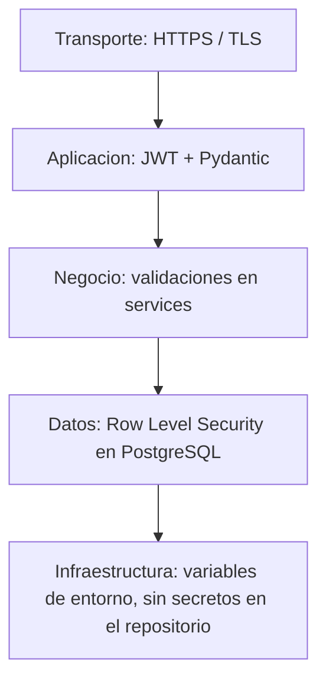
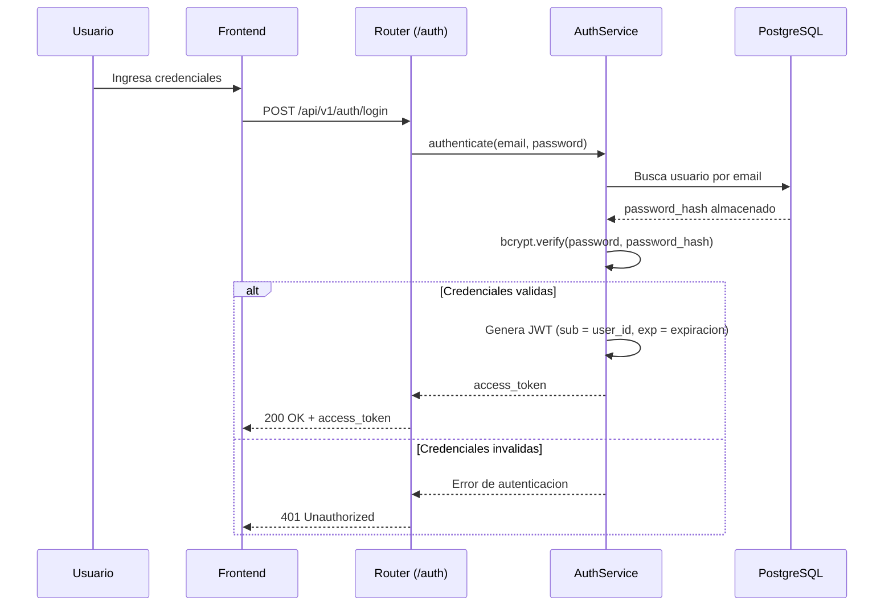
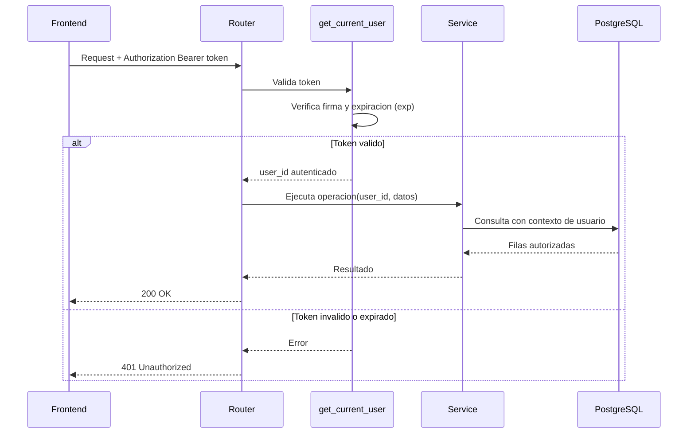
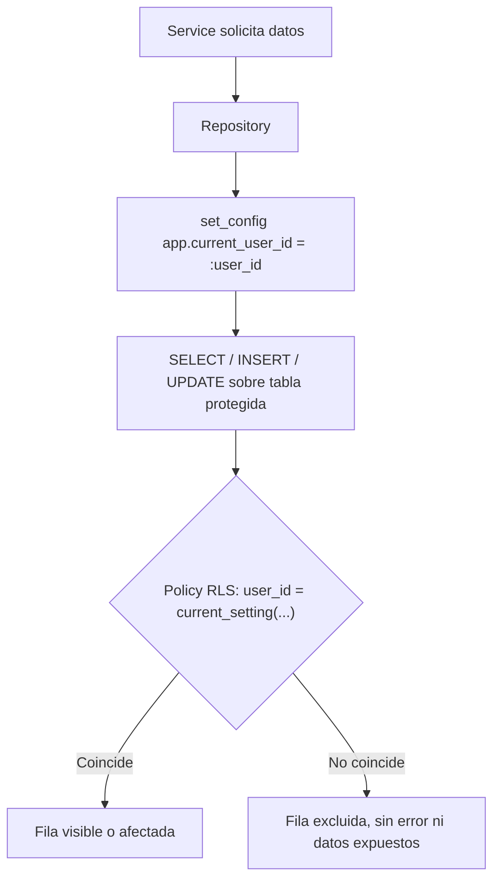

# Documentación de Seguridad — FinTrack

> Informe técnico de seguridad, redactado en formato de auditoría interna.

**Alcance:** autenticación, autorización, gestión de credenciales, validación de datos, protección de la base de datos y superficie de ataque de la API REST de FinTrack.
**Naturaleza del documento:** autoevaluación técnica realizada por el equipo de desarrollo del proyecto, con fines de documentación de portafolio. No constituye una auditoría de seguridad certificada por un tercero independiente ni un pentest formal; antes de operar con usuarios reales y datos financieros en producción, se recomienda una revisión externa (ver sección 15).

---

## Tabla de contenido

1. [Introducción a la seguridad de FinTrack](#1-introducción-a-la-seguridad-de-fintrack)
2. [Objetivos de seguridad](#2-objetivos-de-seguridad)
3. [Arquitectura de seguridad](#3-arquitectura-de-seguridad)
4. [Flujo de autenticación JWT](#4-flujo-de-autenticación-jwt)
5. [Gestión de credenciales](#5-gestión-de-credenciales)
6. [Hashing de contraseñas con bcrypt](#6-hashing-de-contraseñas-con-bcrypt)
7. [Autorización de usuarios](#7-autorización-de-usuarios)
8. [Protección mediante Row Level Security](#8-protección-mediante-row-level-security)
9. [Validación de datos con Pydantic](#9-validación-de-datos-con-pydantic)
10. [Prevención de SQL Injection](#10-prevención-de-sql-injection)
11. [Prevención de acceso indebido entre usuarios](#11-prevención-de-acceso-indebido-entre-usuarios)
12. [Riesgos identificados](#12-riesgos-identificados)
13. [Riesgos mitigados](#13-riesgos-mitigados)
14. [Buenas prácticas implementadas](#14-buenas-prácticas-implementadas)
15. [Recomendaciones futuras de seguridad](#15-recomendaciones-futuras-de-seguridad)
16. [Conclusiones](#16-conclusiones)

---

## 1. Introducción a la seguridad de FinTrack

FinTrack procesa información financiera personal: cuentas, transacciones, presupuestos y metas de ahorro. Aunque no almacena credenciales bancarias ni datos de tarjetas, la naturaleza sensible de esta información exige un diseño de seguridad explícito, no incidental. Este documento describe los mecanismos de seguridad implementados, evalúa su cobertura frente a los riesgos más relevantes para una API financiera, e identifica brechas pendientes de cerrar antes de un eventual paso a producción con usuarios reales.

El análisis sigue una estructura habitual en informes de seguridad técnica: arquitectura, mecanismos de control, hallazgos (riesgos identificados y mitigados) y recomendaciones.

## 2. Objetivos de seguridad

- **Confidencialidad:** ningún usuario debe poder leer información financiera de otro usuario.
- **Integridad:** los datos ingresados deben validarse antes de persistirse, y las operaciones que afectan múltiples registros (por ejemplo, una transferencia) deben ser consistentes.
- **Autenticación:** verificar de forma confiable la identidad de quien realiza cada petición.
- **Autorización:** limitar cada operación exclusivamente a los recursos que pertenecen al usuario autenticado.
- **Disponibilidad razonable:** el sistema debe resistir errores de entrada malformada sin degradarse ni exponer información interna (trazas de error, detalles de la base de datos).
- **Trazabilidad:** dejar registro de eventos de seguridad relevantes (fallos de autenticación, errores de autorización) para facilitar la detección de incidentes.

## 3. Arquitectura de seguridad

FinTrack aplica seguridad en profundidad (*defense in depth*): ningún control depende en solitario de que los demás estén libres de errores.



Cada capa asume que la anterior puede fallar. En particular, la combinación de autorización aplicativa (capa C) y Row Level Security (capa D) es la que distingue a FinTrack de una implementación que confía únicamente en el código de la aplicación para aislar los datos entre usuarios.

## 4. Flujo de autenticación JWT

**Emisión del token (registro / inicio de sesión):**



**Validación del token en peticiones autenticadas:**



El token JWT contiene únicamente los datos mínimos necesarios (identificador del usuario y expiración) en su payload; no se incluye información sensible, ya que el payload de un JWT no está cifrado, solo firmado.

## 5. Gestión de credenciales

- Las contraseñas nunca se almacenan ni se registran (logging) en texto plano, en ningún punto del sistema.
- La clave de firma de los JWT (`JWT_SECRET_KEY`) se gestiona mediante variables de entorno, nunca incluida en el código fuente ni en el control de versiones.
- El archivo `.env` con credenciales reales está excluido del repositorio mediante `.gitignore`.
- Se recomienda una política de contraseñas mínima (longitud mínima, combinación de caracteres) aplicada en el `schema` de registro mediante validadores de Pydantic.

## 6. Hashing de contraseñas con bcrypt

Las contraseñas se procesan con bcrypt a través de Passlib antes de almacenarse:

```python
from passlib.context import CryptContext

pwd_context = CryptContext(schemes=["bcrypt"], deprecated="auto")

def hash_password(password: str) -> str:
    return pwd_context.hash(password)

def verify_password(plain_password: str, hashed_password: str) -> bool:
    return pwd_context.verify(plain_password, hashed_password)
```

Características relevantes de bcrypt para este caso de uso:

- Genera una **sal (salt) aleatoria** por cada contraseña, por lo que dos usuarios con la misma contraseña obtienen hashes distintos.
- Incluye un **factor de costo configurable**, que permite ajustar el tiempo de cómputo necesario para calcular el hash, dificultando ataques de fuerza bruta incluso si la base de datos se ve comprometida.
- La verificación se realiza recalculando el hash con la sal almacenada y comparándolo, sin necesidad de exponer nunca la contraseña original.

## 7. Autorización de usuarios

La autenticación responde a "quién eres"; la autorización responde a "qué puedes hacer". En FinTrack, todo usuario autenticado tiene el mismo rol (no existen roles administrativos en el alcance actual), pero cada operación está acotada a sus propios recursos mediante dos controles independientes:

1. **A nivel de `service`:** antes de ejecutar una operación sobre una cuenta, categoría o transacción, se valida explícitamente que el recurso pertenezca al `user_id` autenticado.
2. **A nivel de base de datos:** las políticas de Row Level Security actúan como control redundante, descrito en la sección 8.

Esta autorización explícita en dos capas es lo que se documenta con mayor detalle en las secciones 8 y 11.

## 8. Protección mediante Row Level Security

Cada tabla que almacena información propia de un usuario (`accounts`, `transactions`, `budgets`, `savings_goals`) tiene habilitada Row Level Security, con una política equivalente a:

```sql
ALTER TABLE transactions ENABLE ROW LEVEL SECURITY;

CREATE POLICY transactions_user_isolation ON transactions
    USING (user_id = current_setting('app.current_user_id')::uuid)
    WITH CHECK (user_id = current_setting('app.current_user_id')::uuid);
```

El `repository` establece el contexto de usuario en cada operación antes de ejecutar la consulta:



El resultado clave de este diseño: si el `service` tuviera un error y omitiera filtrar por usuario, la consulta seguiría sin poder devolver ni modificar filas de otro usuario, porque la restricción se aplica dentro del motor de base de datos, no en el código de la aplicación.

## 9. Validación de datos con Pydantic

Todo dato que entra a la API pasa primero por un `schema` de Pydantic antes de llegar a la lógica de negocio:

```python
class TransactionCreate(BaseModel):
    account_id: UUID
    category_id: UUID
    amount: Decimal = Field(gt=0)
    type: Literal["income", "expense", "transfer"]
    description: str | None = Field(default=None, max_length=255)
```

Esto cumple dos funciones de seguridad:

- **Rechazo temprano de datos malformados:** si un campo no cumple el tipo o las restricciones definidas, FastAPI responde `422 Unprocessable Entity` antes de ejecutar cualquier lógica de negocio o consulta a la base de datos.
- **Prevención de asignación masiva (mass assignment):** al definir explícitamente qué campos acepta cada `schema`, un cliente no puede enviar campos adicionales (por ejemplo, intentar establecer directamente el `user_id` de otro usuario) para que sean persistidos sin control.

## 10. Prevención de SQL Injection

La capa de `repositories` utiliza exclusivamente consultas parametrizadas (o el ORM, según la implementación), nunca concatenación de cadenas con datos provenientes del usuario:

```python
# Correcto: la entrada del usuario se pasa como parametro, no se concatena
self.db.execute(
    "SELECT * FROM transactions WHERE account_id = :account_id",
    {"account_id": account_id},
)
```

Con este enfoque, el motor de base de datos trata cualquier valor de entrada estrictamente como dato, nunca como código SQL ejecutable, sin importar su contenido. Esta práctica, combinada con Row Level Security, forma dos barreras independientes: aunque una consulta estuviera mal construida, RLS seguiría restringiendo el conjunto de filas accesibles.

## 11. Prevención de acceso indebido entre usuarios

El acceso indebido a recursos de otro usuario —conocido como *Broken Object Level Authorization* (BOLA), la categoría API1:2023 del [OWASP API Security Top 10](https://owasp.org/www-project-api-security/)— es uno de los riesgos más frecuentes en APIs REST. FinTrack lo mitiga con el mismo control de doble capa descrito en las secciones 7 y 8:

1. El `service` verifica explícitamente la propiedad del recurso antes de operar sobre él.
2. Row Level Security actúa como control de respaldo a nivel de base de datos, independiente de que la verificación anterior se haya implementado correctamente en cada endpoint nuevo.

Esta redundancia es intencional: en proyectos que crecen agregando endpoints con el tiempo, es común que una verificación de propiedad se olvide en un nuevo endpoint. RLS convierte ese error de programación en un no-evento, en lugar de una fuga de datos.

## 12. Riesgos identificados

| Riesgo | Severidad | Estado |
|---|---|---|
| Ausencia de límite de intentos de inicio de sesión (fuerza bruta sobre `/auth/login`) | Alta | Pendiente |
| Ausencia de verificación de correo electrónico en el registro | Media | Pendiente |
| Sin autenticación multifactor (MFA) | Media | Pendiente |
| Sin mecanismo de revocación de tokens JWT antes de su expiración (por ejemplo, ante robo de sesión) | Media | Pendiente |
| Almacenamiento de secretos en texto plano en el código fuente | Alta | Mitigado |
| Contraseñas en texto plano en base de datos | Alta | Mitigado |
| Acceso cruzado de datos entre usuarios (BOLA) | Alta | Mitigado |
| Inyección SQL desde parámetros de entrada | Alta | Mitigado |
| Datos de entrada malformados o con campos no esperados | Media | Mitigado |
| Ausencia de registro (logging) estructurado de eventos de seguridad | Media | Pendiente |
| Sin escaneo automatizado de vulnerabilidades en dependencias | Baja | Pendiente |

El endpoint de login aplica un límite de cinco intentos por IP en una ventana de cinco minutos. El contador actual vive en memoria del proceso; en un despliegue con varias réplicas debe sustituirse por un almacén compartido o por un rate limiter del proxy de entrada.

## 13. Riesgos mitigados

- **Exposición de contraseñas:** mitigado mediante hashing bcrypt con sal aleatoria y factor de costo configurable (sección 6); ni siquiera un acceso directo a la base de datos expone las contraseñas originales.
- **Acceso cruzado entre usuarios (BOLA):** mitigado mediante verificación explícita de propiedad en `services` y, de forma redundante, mediante Row Level Security en PostgreSQL (secciones 7, 8 y 11).
- **Inyección SQL:** mitigado mediante el uso exclusivo de consultas parametrizadas en la capa de `repositories` (sección 10).
- **Datos malformados o asignación masiva de campos:** mitigado mediante `schemas` explícitos de Pydantic que definen de forma cerrada los campos aceptados (sección 9).
- **Secretos en el código fuente:** mitigado mediante configuración por variables de entorno y exclusión de `.env` del control de versiones (sección 5).
- **Interceptación de datos en tránsito:** mitigado mediante el uso de HTTPS/TLS en el entorno de despliegue (Render).
- **Cabeceras de seguridad básicas:** mitigado mediante `X-Content-Type-Options`, `X-Frame-Options`, `Referrer-Policy`, `Permissions-Policy` y HSTS en producción.
- **XSS en contenido financiero:** mitigado en el frontend mediante escape explícito de valores antes de renderizarlos en HTML.

## 14. Buenas prácticas implementadas

- Defensa en profundidad: ningún control de seguridad es el único mecanismo de protección para su riesgo asociado.
- Principio de mínimo privilegio a nivel de base de datos, mediante RLS.
- Autenticación sin estado (JWT), que evita almacenar sesiones del lado del servidor y facilita la escalabilidad horizontal.
- Validación de entrada centralizada y declarativa mediante Pydantic, en lugar de validaciones dispersas en el código.
- Separación de responsabilidades entre capas, que reduce la probabilidad de que un error de negocio se traduzca en una vulnerabilidad de datos.
- Gestión de configuración sensible mediante variables de entorno, siguiendo el principio de no versionar secretos.

## 15. Recomendaciones futuras de seguridad

- Implementar limitación de tasa (*rate limiting*) y bloqueo temporal tras múltiples intentos fallidos en `/auth/login`, para mitigar ataques de fuerza bruta.
- Incorporar verificación de correo electrónico y, opcionalmente, autenticación multifactor (TOTP) para cuentas nuevas.
- Definir una estrategia de expiración corta para el `access_token` junto con un `refresh_token` de mayor duración, e implementar una lista de revocación para invalidar tokens ante cierre de sesión o sospecha de compromiso.
- Restringir `CORS_ORIGINS` en producción exclusivamente al dominio real del frontend desplegado, sin comodines.
- Añadir cabeceras de seguridad HTTP (HSTS, `X-Content-Type-Options`, `Content-Security-Policy`) en las respuestas del backend y del sitio estático.
- Incorporar registro estructurado (logging) de eventos de seguridad relevantes: intentos fallidos de autenticación, errores de autorización, cambios de contraseña.
- Automatizar el escaneo de vulnerabilidades en dependencias (por ejemplo, `pip-audit` o Dependabot) como parte del pipeline de integración continua.
- Antes de operar con usuarios reales y datos financieros en producción, someter la aplicación a una revisión de seguridad o prueba de penetración realizada por un tercero independiente.

## 16. Conclusiones

FinTrack aplica un modelo de seguridad en profundidad en el que la autorización de la aplicación y las políticas de Row Level Security de PostgreSQL actúan como controles independientes y redundantes frente al riesgo más crítico de una API financiera: el acceso cruzado de datos entre usuarios. Combinado con hashing robusto de contraseñas, validación estricta de entrada y consultas parametrizadas, el proyecto cubre adecuadamente los riesgos fundamentales de una aplicación de este tipo en etapa de portafolio.

Las brechas pendientes identificadas en este informe (rate limiting, MFA, revocación de tokens, logging de seguridad) son propias de la madurez esperada en un proyecto en desarrollo activo, y quedan documentadas como hoja de ruta hacia un nivel de seguridad apto para producción con usuarios reales.

---

## Referencias

- OWASP — [API Security Top 10](https://owasp.org/www-project-api-security/).
- PostgreSQL — [Row Security Policies](https://www.postgresql.org/docs/current/ddl-rowsecurity.html).
- Passlib — [CryptContext y esquema bcrypt](https://passlib.readthedocs.io/).
